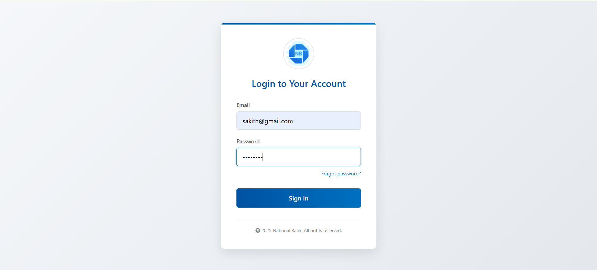
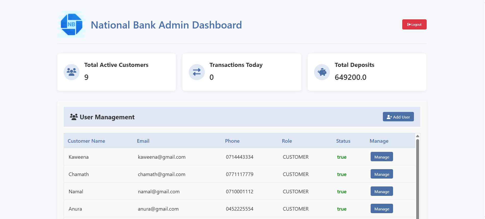
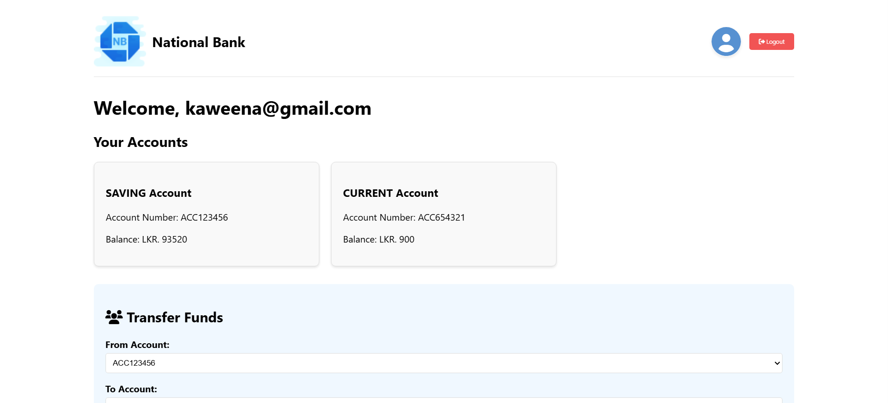
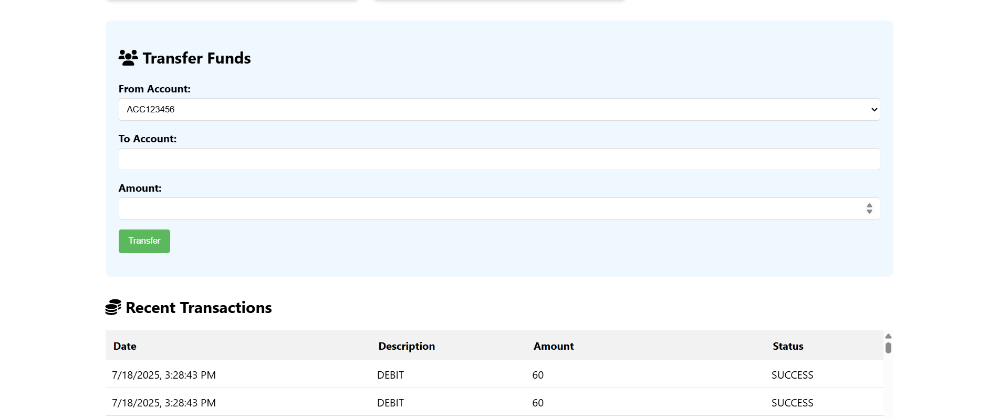
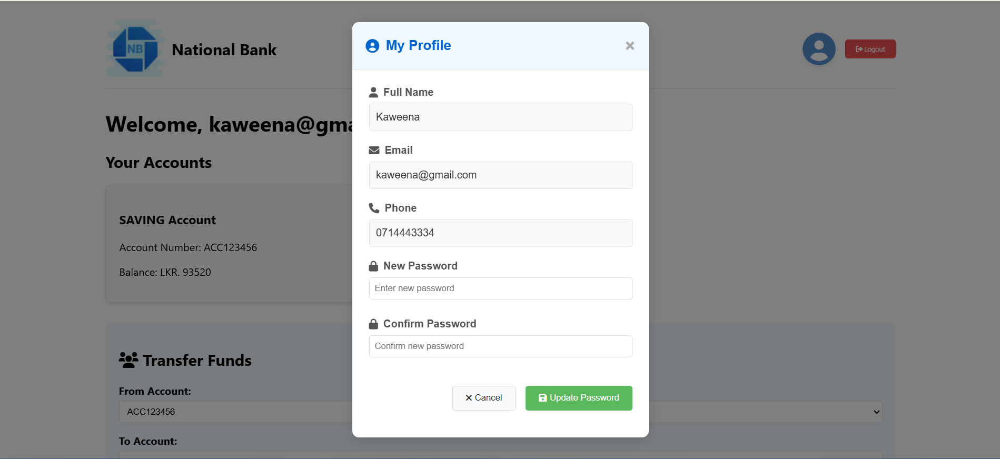

# 🏦 National Bank — Enterprise Banking System

A full-stack enterprise banking application built with **Jakarta EE 10**, **EJB**, **JPA**, and **Jakarta Security**. The system supports customer account management, fund transfers, scheduled payments, interest calculations, and email notifications — all deployed as a multi-module Maven EAR project on a Jakarta EE application server (e.g., GlassFish / Payara).

---
## 📸 Screenshots

### Login Page


### Admin Dashboard


### Customer Dashboard




## 📁 Project Structure

This is a **multi-module Maven project** composed of the following modules:

```
national-bank/
├── core/           # Shared models, DTOs, service interfaces, utilities, mail
├── auth/           # Security — identity store & authentication mechanism
├── business/       # EJB session beans (business logic)
├── web/            # Servlets, JSP pages, REST endpoints
└── ear/            # Enterprise Archive — packages everything for deployment
```

---

## ✨ Features

### 👥 User Management
- Admin can register new customers (with welcome email sent automatically)
- Admin can view, update, and deactivate customer accounts
- Role-based access control: `ADMIN` and `CUSTOMER` roles

### 🏦 Account Management
- Admin can create bank accounts (Saving / Current) for customers
- Customers can view their account balances
- System tracks a special internal bank account for interest payouts

### 💸 Fund Transfers
- Real-time fund transfers between accounts
- Minimum transfer amount validation (> Rs. 50)
- Full transaction history per user

### ⏰ Scheduled Transfers
- Customers can schedule future transfers with a date/time picker
- Transfers are executed automatically via EJB `TimerService`
- Customers can cancel pending scheduled tasks
- REST API to view/cancel scheduled tasks

### 📈 Interest Calculation
- Daily interest calculated at 23:59 for all saving accounts
- Monthly interest credited to accounts on the last day of each month
- Customers can view their monthly interest breakdown

### 📊 Daily Balance Tracking
- Bank total deposits are recorded every minute
- Change percentage vs previous balance is calculated and stored
- Admin dashboard shows last 30 days of balance history

### 📧 Email Notifications
- Welcome email sent on new customer registration
- Password change verification code sent via email
- Async email delivery via a custom thread pool (`MailServiceProvider`)

### 🔐 Security
- Jakarta Security with custom `IdentityStore` and `HttpAuthenticationMechanism`
- MD5-encrypted passwords
- Session-based authentication with role-based redirects
- Protected routes return HTTP 403 for unauthorized access

### 🪵 Interceptors
- `@Loggable` — logs method entry/exit and exceptions
- `@TimeoutLogger` — logs EJB timer method execution and timing

---

## 🛠️ Tech Stack

| Layer | Technology |
|---|---|
| Language | Java 11 |
| Platform | Jakarta EE 10 |
| EJB | Stateless, Singleton, Timer Service |
| Persistence | JPA (Jakarta Persistence) |
| Security | Jakarta Security Enterprise |
| Web | Servlets, JSP, JSTL |
| REST | Jakarta REST (JAX-RS) |
| Email | Jakarta Mail via Mailtrap (SMTP) |
| Build | Maven (multi-module) |
| Frontend | HTML, CSS, JavaScript, Font Awesome |
| JSON | Gson |
| Deployment | EAR (GlassFish / Payara Server) |

---

## ⚙️ Prerequisites

- Java 11+
- Maven 3.8+
- GlassFish 7 / Payara 6 (or any Jakarta EE 10 compatible server)
- A running database (configured via JDBC in your app server)
- Mailtrap account (or any SMTP provider) for email features

---

## 🚀 Getting Started

### 1. Clone the Repository

```bash
git clone https://github.com/sasmitha-git/national-bank.git
cd national-bank
```

### 2. Configure Application Properties

Create or update `application.properties` in the `core` module resources:

```properties
# Interest
interest.rate.savings=0.06

# System Account
system.account=SYS-0001

# App Email
app.email=no-reply@nationalbank.lk

# Mailtrap SMTP
mailtrap.host=smtp.mailtrap.io
mailtrap.port=587
mailtrap.username=your_mailtrap_username
mailtrap.password=your_mailtrap_password
```

### 3. Configure Database (on your app server)

Set up a JDBC connection pool and data source on GlassFish/Payara pointing to your database. Update `persistence.xml` in the `core` module accordingly.

### 4. Build the Project

```bash
mvn clean package
```

This generates a deployable `ear/target/national-bank.ear` file.

### 5. Deploy

Deploy the generated `.ear` file to your Jakarta EE server via:
- The GlassFish/Payara Admin Console, or
- The `asadmin deploy` command:

```bash
asadmin deploy ear/target/national-bank.ear
```

### 6. Access the Application

```
http://localhost:8080/web-module/
```

---

## 🔑 Default Roles

| Role | Access |
|---|---|
| `ADMIN` | Dashboard, user management, account creation, all transactions |
| `CUSTOMER` | Personal dashboard, transfers, scheduled tasks, interest view |

---

## 📡 REST API Endpoints

Base path: `/api`

| Method | Endpoint | Description |
|---|---|---|
| `GET` | `/api/accounts?userId={id}` | Get accounts for a user |
| `GET` | `/api/scheduled-tasks?userId={id}` | Get all scheduled tasks for a user |
| `DELETE` | `/api/scheduled-tasks/{taskId}` | Cancel a scheduled task |

---

## 🗃️ Database Entities

- **User** — customers and admins
- **Account** — bank accounts (SAVING, CURRENT, BANK types)
- **Transaction** — fund transfer records
- **Interest** — daily interest logs per account
- **Balance** — daily total bank deposit snapshots
- **ScheduledTask** — future-scheduled transfers

---

## 📝 License

This project is developed for educational purposes.

---

## 👤 Author

Developed by sasmitha-git, Sri Lanka.  
Feel free to connect or contribute!